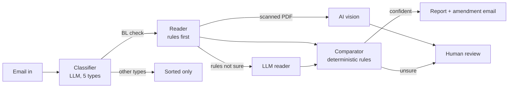

# CargoCheck ⚓

**Catch the wrong BL before it sails.**

CargoCheck reads a shipping team's inbox, sorts every email, compares each draft Bill of Lading (BL) with its Shipping Instruction (SI) field by field, and sends only the unclear cases to a person, with the evidence attached.

Built for the **Averis Hackathon 2026**, shipping document verification challenge.

|                       |                                                                                                                                     |
| --------------------- | ----------------------------------------------------------------------------------------------------------------------------------- |
| 🌐**Live demo** | [nazaralopulisa-cargocheck-appdashboard-iincwc.streamlit.app](https://nazaralopulisa-cargocheck-appdashboard-iincwc.streamlit.app/)  |

---

## The problem

Shipping operations teams receive document-check requests mixed in with new SI requests, invoice queries, general updates and spam. A missed request never gets checked. Comparing an SI with a draft BL by hand is slow and error-prone, and the same field is labelled differently across documents ("Port of Loading", "Load Port", "POL"). A missed difference means amendments, delays and extra work.

## What CargoCheck does

1. **Sorts every email** into 5 types: BL check, new SI request, invoice query, general, spam.
2. **Reads the SI and draft BL**, from plain text, PDF, Word, Excel or scanned PDFs.
3. **Compares 7 fields**: shipper, consignee, notify party, port of loading, port of discharge, container count and gross weight (kg).
4. **Asks a person when unsure**: missing attachments, the wrong document, unreadable scans or missing values go to a review queue with the evidence, instead of being guessed.
5. **Helps act on it**: a ready-to-send amendment email for every mismatch, and a CSV/JSON export for the team.

## Results

Validated on the organizers' evaluation set of **520 real shipping emails**, using their own scoring server:

| Metric                                                 | Result                     |
| ------------------------------------------------------ | -------------------------- |
| Final score                                            | **100%**             |
| Emails sorted into the right type                      | 520 of 520                 |
| BL discrepancies caught, with exactly the right fields | 46 of 46                   |
| False alarms                                           | 0                          |
| Unclear cases sent to a person                         | 20 of 20, none unnecessary |

Every change was scored and logged in `output/score_log.csv`. The score rose from 63% (rules only) to 100% as we added document reading for PDF/Word/Excel, fixed document-type detection, caught port-code traps and routed scans to human review. New emails may be harder than the test set, which is why anything uncertain still goes to a person.

---

## Architecture

CargoCheck is an orchestrated pipeline: each step uses the right tool, and anything uncertain is escalated to a person. **AI reads and understands; plain code compares and decides.**



### Why not let an LLM compare everything?

- **Traps in the data.** Some BLs change the city but keep the same port code, e.g. `MOMBASA, KENYA (KEMBA)` vs `TUTICORIN, INDIA (KEMBA)`. Our comparator requires both the code and the city to agree.
- **Hallucination.** On one PDF, overlapping text made the LLM invent a company name. Deterministic comparison, and reading PDF text in file order, prevent this.
- **Consistency, cost and auditability.** Rules give the same answer every time, cost nothing, and every decision can be traced back to a line in a document. Free rules read almost half of all documents; the LLM steps in only where they aren't confident.

### Human in the loop

| Situation                                            | What happens                                        |
| ---------------------------------------------------- | --------------------------------------------------- |
| The sender says documents are attached, but none are | Review: missing attachment                          |
| An attachment isn't an SI or a BL (e.g. an invoice)  | Review: wrong document type                         |
| A required value is missing ("TBA", "N/A", blank)    | Review: missing value                               |
| A scanned document was read by AI vision             | Always reviewed, with the transcription as evidence |
| "Please send the draft BL" with nothing attached     | Not an error: nothing to compare yet                |

Reviews are layered on top of the system's result and never overwrite it, so every review can be undone. Staff reviews update the dashboard and export but never change the scored `submission.json`.

---

## Dashboard

| Page                      | What it shows                                                                                                                                                                                                                                |
| ------------------------- | -------------------------------------------------------------------------------------------------------------------------------------------------------------------------------------------------------------------------------------------- |
| **Overview**        | What CargoCheck does, then insight cards: which fields go wrong most often, which shippers to follow up with, the inbox breakdown and how documents were read                                                                                |
| **Inbox**           | Tabs by what needs doing (needs a person, mismatches to fix, clean and resolved, other). Each email shows the SI and BL side by side with differences highlighted, a banner saying what to do, a draft amendment email and a CSV/JSON export |
| **Check documents** | Upload a whole email with its attachments, or an SI and BL pair, and see it checked live                                                                                                                                                     |
| **Review queue**    | Evidence next to a form to confirm or correct values, with reviewer name, note and undo                                                                                                                                                      |
| **Accuracy**        | Live accuracy from staff reviews (agreement rate, corrections by field, reported misses), plus the pre-launch evaluation results                                                                                                             |

## Tech stack

| Layer            | Technology                                                              |
| ---------------- | ----------------------------------------------------------------------- |
| Language         | Python 3.12+ (tested on 3.12 and 3.14)                                  |
| LLM              | Amazon Bedrock, Nova 2 Lite (Gemini supported as a switchable fallback) |
| Document reading | pdfplumber, pypdfium2 (scans for AI vision), python-docx, openpyxl      |
| Dashboard        | Streamlit, pandas                                                       |
| Review storage   | Local JSON, or Amazon S3 when`REVIEWS_BUCKET` is set                  |
| Packaging        | Docker (Streamlit Community Cloud or AWS App Runner)                    |
| Evaluation       | The organizers' Docker scoring server                                   |

## Project structure

```
CargoCheck/
├── app/
│   ├── classifier.py        # sorts emails into 5 types (batched, resumable)
│   ├── rule_extractor.py    # reads the 7 fields with plain code
│   ├── extractor.py         # LLM extraction when the rules aren't confident
│   ├── doc_reader.py        # PDF, Word, Excel and scans (AI vision) to text
│   ├── normalizer.py        # makes equivalent values equal ("22 MT" = 22,000 kg)
│   ├── comparer.py          # compares SI and BL field by field
│   ├── pipeline.py          # runs everything, builds and scores submission.json
│   ├── reviews.py           # human decisions, layered on top of the AI result
│   ├── export.py            # CSV/JSON export with a confidence level per email
│   ├── llm.py               # one switch between Bedrock and Gemini
│   ├── dashboard.py         # the Streamlit web app
│   ├── diagnose.py          # debugging: why emails were flagged
│   └── review_mismatches.py # debugging: raw lines next to extracted values
├── data/sdoc-hackathon-bundle/   # the organizers' participant bundle
├── output/                       # results: classifications, extractions, scores
├── .streamlit/config.toml        # dashboard theme
├── Dockerfile
├── requirements.txt
└── .env.example
```

---

## Written responses

### 1. Problem-solution alignment

The problem statement asks the system to classify, extract, compare and ask for help. Each maps to a part of CargoCheck:

| The problem                                                              | How CargoCheck solves it                                                                                                                                                      |
| ------------------------------------------------------------------------ | ----------------------------------------------------------------------------------------------------------------------------------------------------------------------------- |
| Document requests get lost among SI requests, invoices, updates and spam | Every email is sorted into 5 types; 520 of 520 sorted correctly on the evaluation set                                                                                         |
| Comparing SI and BL by hand is slow and error-prone                      | 7 fields compared automatically; mismatches shown side by side (e.g.`SI: 3 / BL: 4`), with a ready amendment email                                                          |
| The same field has different labels ("Port of Loading" vs "Load Port")   | The rule extractor maps label variants by meaning; the LLM reads unusual layouts                                                                                              |
| The system must ask for help instead of guessing or failing silently     | Missing attachments, wrong documents, unreadable scans and missing values go to a review queue with the reason and evidence; processing failures are shown and can be retried |

We also covered every advanced stage: PDF and Word (plus Excel) attachments, scanned documents (AI vision), messier inputs (label variations, misleading subjects, missing attachments, SI details typed into the email body), and reliability with human review, where a person confirms or corrects a case and the report updates.

The organizers told us operations managers care most about accuracy and the total number of discrepancies, and that staff often discover misses themselves. So the dashboard leads with discrepancies, shows accuracy from staff reviews, and lets staff report a discrepancy the system missed.

### 2. AI and cloud infrastructure integration

**AI where it adds value, plain code where it doesn't.**

| Step                     | Technology                                                    | Why                                                                                                    |
| ------------------------ | ------------------------------------------------------------- | ------------------------------------------------------------------------------------------------------ |
| Email classification     | Amazon Nova 2 Lite on Amazon Bedrock, 25 emails per call      | Understanding intent ("please check these" vs "please send the draft BL") needs language understanding |
| Document reading         | Rules first; Nova 2 Lite only when the rules aren't confident | Rules are free, instant and predictable; the LLM handles unusual layouts                               |
| Scanned documents        | Nova 2 Lite vision on rendered page images                    | Scans have no text layer; results always go to a person to confirm                                     |
| Comparison and decisions | Deterministic Python rules                                    | Consistent, auditable, and not fooled by traps like same-code/different-city ports                     |

**Cloud and deployment**

- **Amazon Bedrock** (global cross-region inference from `ap-southeast-1`), called through one provider switch (`llm.py`) so we can move between Bedrock and Gemini with a single setting. We switched from Gemini's free tier to Bedrock mid-project when quotas ran out, without changing any pipeline code.
- **Docker** image for the dashboard and pipeline, deployable to Streamlit Community Cloud or AWS App Runner.
- **Amazon S3** for storing human reviews when `REVIEWS_BUCKET` is set, so reviews survive restarts.
- **Secrets** (API keys) live in the hosting platform's settings, never in the code or image.
- The organizers' **Docker scoring server** was part of our development loop: every change was scored and logged.

### 3. User feedback and testing

**How we tested**

- **Scored evaluation, every change.** Each fix was run against the organizers' 520-email evaluation set through their scoring server and logged with a note (`output/score_log.csv`). This is how we found and fixed the port-code traps, Excel title detection, overlapping PDF text and more.
- **Root-cause tools.** `diagnose.py` explains why each email was flagged; `review_mismatches.py` puts raw document lines next to extracted values, which is how we found a hidden extraction error the scores alone couldn't show.
- **Automated self-tests.** The rule extractor, normalizer and comparer each include self-tests built from real layouts in the data (names on two lines, Chinese text in labels, Excel sheet titles, port traps).
- **End-to-end dashboard tests.** We drove the dashboard headlessly to check that resolving a case updates every count, that reviews can be undone, and that exports include the reviewer.
- **Walkthroughs as new users.** Trying the dashboard as first-time users led to the "How it works" strip, task-based inbox tabs, action-oriented banners ("Ask for the draft BL to be amended"), and consistent counts across every page.

**Feedback built into the product.** Staff can confirm, correct, or report a discrepancy the system missed. The Accuracy page turns this into live metrics: how often staff agreed with CargoCheck, which fields they corrected most, and how many misses were reported.

[ADD ANY FEEDBACK FROM PEOPLE WHO TRIED CARGOCHECK, e.g. mentors, classmates or shipping staff, and what you changed because of it.]

### 4. Coding challenges

| Challenge                                 | Solution                                                                                                                                                                                     |
| ----------------------------------------- | -------------------------------------------------------------------------------------------------------------------------------------------------------------------------------------------- |
| Free-tier AI quotas and overloaded models | Batched 25 emails per call, saved progress after every batch, resumable runs, then moved to Amazon Bedrock behind a provider switch                                                          |
| PDF, Word and Excel attachments           | The organizers' loader only reads plain text, so we built our own reader for every format, including AI vision for scans                                                                     |
| Titles in odd places                      | Excel titles in sheet names, Word titles in page headers, and "invoice" inside an SI field; now we read sheet names and headers, and only a stand-alone title can mark a document as "other" |
| Port-code traps                           | The city changed but the code stayed the same (Mombasa vs Tuticorin, both`KEMBA`); ports must now match on code **and** city                                                         |
| Company names on two lines                | "APRIL FINE PAPER TRADING" + "ON BEHALF OF VITAL SOLUTIONS PTE LTD" were read inconsistently; we now join the continuation line and stop at the address                                      |
| Overlapping text in PDFs                  | A label printed over its value garbled the text, and the LLM invented a company name; we now read PDF text in file order                                                                     |
| Misleading emails                         | "Send the draft BL" with no files, reminders that look like SI requests, SI details typed in the body; a rule for each pattern                                                               |
| Unreliable AI confidence                  | The classifier said "high" for 516 of 520 emails, so escalation is based on concrete checks (missing file, missing value, scan), not the model's self-rating                                 |
| A crash when reading scans in parallel    | The PDF rendering library isn't thread-safe; rendering is now done one page set at a time while everything else stays parallel                                                               |

### 5. Success metrics

**Measured before launch** (organizers' 520-email evaluation set):

| Metric                                                 | Result                                     |
| ------------------------------------------------------ | ------------------------------------------ |
| Emails sorted into the right type                      | 520 of 520                                 |
| BL discrepancies caught, with exactly the right fields | 46 of 46                                   |
| False alarms                                           | 0                                          |
| Unclear cases sent to a person                         | 20 of 20, none unnecessary                 |
| Final score                                            | 63% at the first real run, 100% at the end |

**Measured in use** (live on the Accuracy page and Overview):

- **Agreement rate:** how often staff confirm CargoCheck's result as-is.
- **Missed discrepancies reported by staff:** the real-world miss rate.
- **Fields corrected most often:** where to improve next.
- **Share of BL checks needing a person:** how much work is automated.
- **Discrepancies caught before the BL is finalised**, and an adjustable **time-saved** estimate.

### 6. Scalability plans

The organizers expect about **1,000 emails a day** and **5–10 staff reviewers**.

**Already built for it**

- **Rules first:** almost half of documents are read without any AI call, so cost and time grow slowly.
- **Batching and caching:** 25 emails per classification call; every extraction is cached, so emails are never processed twice.
- **Parallel processing** of several emails at once, with retries and visible failures.
- **A stateless dashboard in Docker**, which can run several copies behind a load balancer.
- **A provider switch** for the AI, so we're not tied to one model or vendor.

**Next steps for production**

| Step                                                                    | Why                                                                                          |
| ----------------------------------------------------------------------- | -------------------------------------------------------------------------------------------- |
| Connect the shared inbox and add a processing queue (e.g. Amazon SQS)   | Process emails continuously as they arrive, instead of in batches                            |
| Move reviews from a JSON file to a database (e.g. DynamoDB or Postgres) | Several reviewers can save at the same time without overwriting each other                   |
| Add a verification agent for mismatches                                 | A second AI pass quotes the exact line from the document as evidence for every flagged field |
| Improve the rules for the most common PDF and Excel layouts             | Raise the share read without AI, lowering cost and latency                                   |
| Staff login and reviewer roles                                          | Know exactly who approved what                                                               |
| More languages; send amendment emails from the dashboard                | Wider use and a complete workflow                                                            |

---

## Setup

### 1. Prerequisites

- Python 3.12 or newer (we've tested on 3.12 and 3.14)
- An Amazon Bedrock API key with access to Nova 2 Lite (or a Gemini API key)
- The organizers' participant bundle, extracted to `data/sdoc-hackathon-bundle/`
- Optional, for scoring: Docker and the organizers' scoring server

### 2. Install

```bash
git clone https://github.com/[YOUR-USERNAME]/CargoCheck.git
cd CargoCheck
python3 -m venv .venv
source .venv/bin/activate          # Windows: .venv\Scripts\activate
pip install -r requirements.txt
```

### 3. Configure

```bash
cp .env.example .env
```

Then fill in `.env`:

| Variable                             | Example                            | Purpose                                                                    |
| ------------------------------------ | ---------------------------------- | -------------------------------------------------------------------------- |
| `LLM_PROVIDER`                     | `bedrock`                        | `bedrock` or `gemini`                                                  |
| `AWS_REGION`                       | `ap-southeast-1`                 | Bedrock region                                                             |
| `BEDROCK_MODEL_ID`                 | `global.amazon.nova-2-lite-v1:0` | Model used for classification, extraction and vision                       |
| `AWS_BEARER_TOKEN_BEDROCK`         | *(your key)*                     | Bedrock API key                                                            |
| `GEMINI_API_KEY`, `GEMINI_MODEL` | *(optional)*                     | Only if`LLM_PROVIDER=gemini`                                             |
| `DATA_DIR`                         | `data/sdoc-hackathon-bundle`     | Where the inbox lives (this is the default)                                |
| `SCORER_URL`                       | `http://localhost:8080`          | The organizers' scoring server (this is the default)                       |
| `REVIEWS_BUCKET`                   | *(optional)*                     | S3 bucket for reviews; leave empty to store them in`output/reviews.json` |

Never commit `.env`; it's in `.gitignore`.

### 4. Run the pipeline

```bash
python app/classifier.py                          # sort all emails (saved to output/)
python app/pipeline.py                            # read, compare, decide; writes output/submission.json
```

Useful options for `pipeline.py`:

| Option                             | What it does                                                                     |
| ---------------------------------- | -------------------------------------------------------------------------------- |
| `--submit --note "what changed"` | Score the result on the organizers' server and log it to`output/score_log.csv` |
| `--rules-only`                   | Never call the LLM (free, no API key needed)                                     |
| `--only email_009`               | Process one email, for debugging                                                 |
| `--skip-extraction`              | Classification-only baseline                                                     |
| `--workers 4`                    | How many emails to read in parallel                                              |

Results are cached in `output/extractions/`, so reruns only process what's new or changed.

### 5. Score it (optional)

Start the organizers' scoring server from their Docker bundle, then submit:

```bash
cd path/to/sdoc-hackathon-docker && docker compose up     # in a separate terminal
python app/pipeline.py --submit --note "my run"
```

### 6. Run the dashboard

```bash
streamlit run app/dashboard.py
```

It opens at `http://localhost:8501`. Type your name in the sidebar before reviewing, so reviews are credited to you.

### Run with Docker

```bash
docker build --platform linux/amd64 -t cargocheck .
docker run -p 8080:8080 --env-file .env cargocheck
```

Then open `http://localhost:8080`.

### Deploy

**Streamlit Community Cloud:** connect this repo, set the main file to `app/dashboard.py`, choose Python 3.12 or newer, and paste the `.env` values into the app's Secrets. Pushes to `main` update the live app automatically.

**AWS App Runner:** build the image with the command above, push it to Amazon ECR, and create an App Runner service on port 8080. Set the environment variables in the service settings, never in the image.

---

## Notes

- The organizers' answer key was never used to tune the system; accuracy was measured only through their scoring server.
- "Consignee" and "To the order of" are treated as different values, as confirmed by the organizers.

## Team

Larpers (Nazara, Akyla, Shi Lynn, Nadya)
